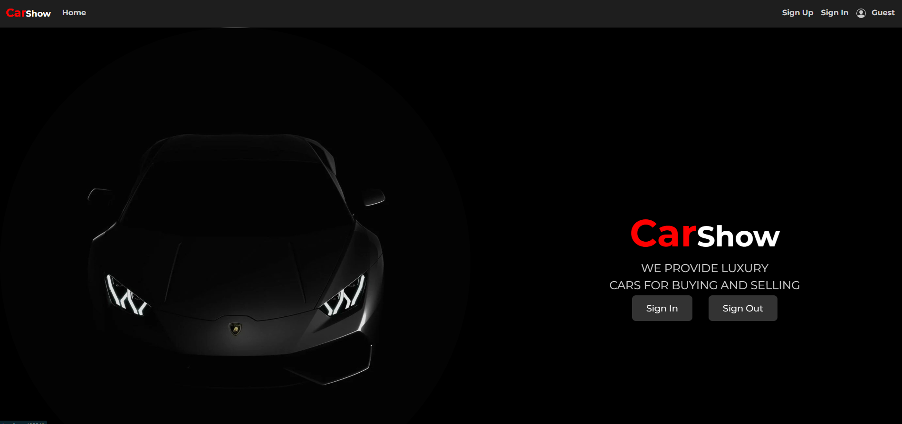
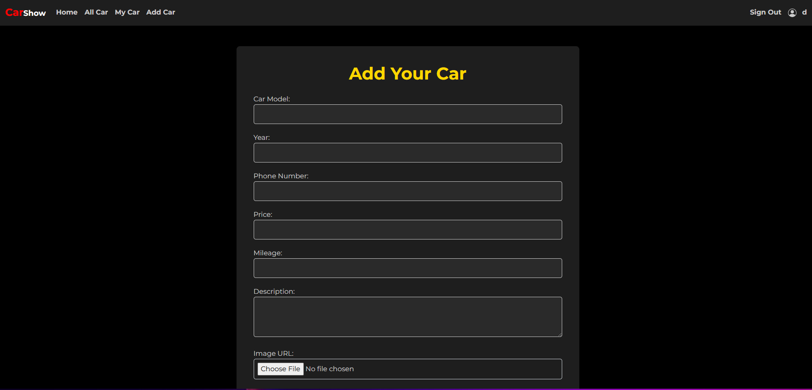
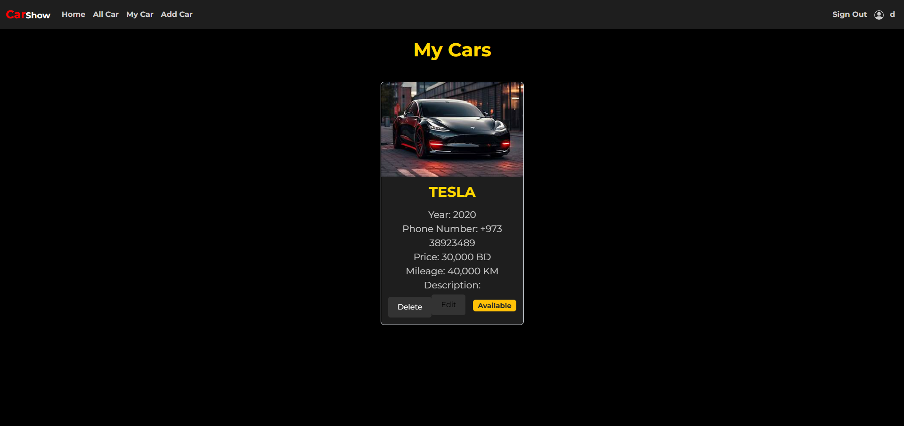
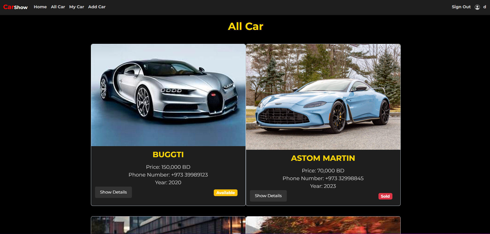

# CarShow

## Description
CarShow is an app for buying and selling cars. It connects car enthusiasts and makes transactions easy.

## Technologies Used
- HTML
- JavaScript
- CSS
- Bootstrap 5.3.3
- EJS
- MongoDB
- Express.js

## Installation
To run this project locally, follow these steps:
1. Clone the repository:
   - git clone https://github.com/SayedAli451/Carshow.git
   - cd Carshow
   - code .

## Screenshot
- Home Page

- Add Car

- My Car

- All Car 

 ## Features
- Search and filter cars
- User profiles for communication
- Notifications for new listings

